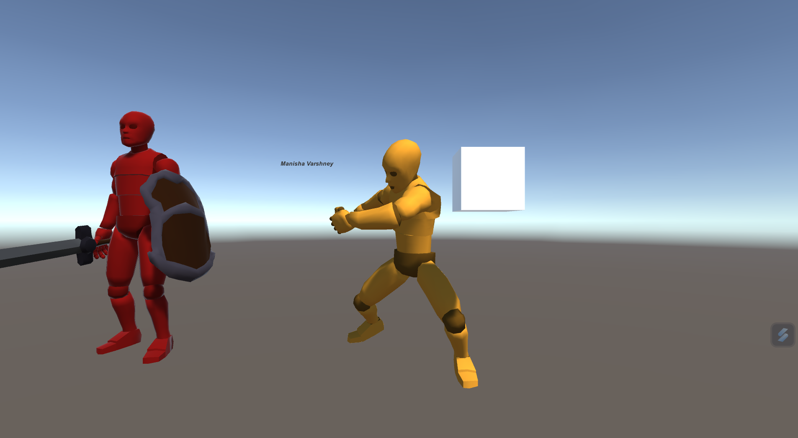

# Unity 3D Demo 

Welcome to the Unity 3D Demo repository! This demo comprises two interactive parts to illustrate Unity 3D capabilities.

## Part 1: Player Movement and Jumping

In this part, a dummy character awaits your command. Use the directional keys to navigate the player, and press the space key for a jump. Experience the fluidity and responsiveness of Unity's character controls.

## Part 2: Dummy Interaction with Objects

Part 2 introduces another dummy character alongside a box. Witness the second dummy's continuous punching animation as it interacts with the box. Marvel at the dynamic behavior where the box vanishes upon impact, showcasing the interaction between the dummy and objects.

## How to Run:

1. **Clone the Repository:**
   ```bash
   git clone https://github.com/manisha-v/Unity3D.git
   cd Unity3D
   ```

2. **Open Unity:**
   - Ensure you have Unity Hub installed.
   - Add the demo folder in Unity Hub.

3. **Load Part 1 or Part 2:**
   - Navigate to the respective part's folder.
   - Open the Unity scene related to the desired demonstration.

4. **Run the Demo:**
   - Inside Unity, press the play button to experience the demo.
   - Follow on-screen instructions for Part 1 or observe Part 2's interaction.

5. **Or just Run the Executable:**
   - Present in the `build` folder.
   - Run the provided executable file (`minor1.exe`) to play the game.

5. **Enjoy:**
   -  Use the directional keys to navigate the player, and press the space key for a jump.

## Preview

Part 1 - 3D Movement

| At Rest | Right Arrow | Left Arrow | Up Arrow | Down Arrow | Space |
|---------------------------|---------------------------|---------------------------|---------------------------|---------------------------|---------------------------|
|  |  |  |  |  |  |

Part 2 - 3D Object Intraction

| Dummy and Object | Object vanishing after punch |
|--------------------------------------|--------------------------------------|
|  |  |

## Need any help?

Feel free to explore and modify the games to suit your needs. I hope you enjoy playing and learning from these games as much as I enjoyed creating them! If you encounter any issues or have suggestions, please open an issue in the respective game's folder.

Connect me on LinkedIn 

Happy coding and gaming! 🌐🕹️
